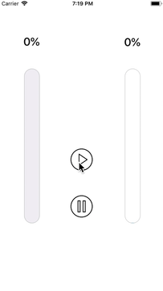
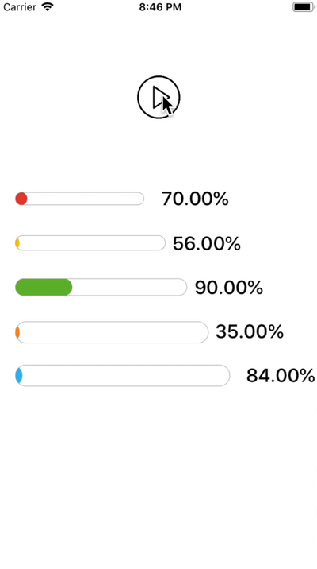
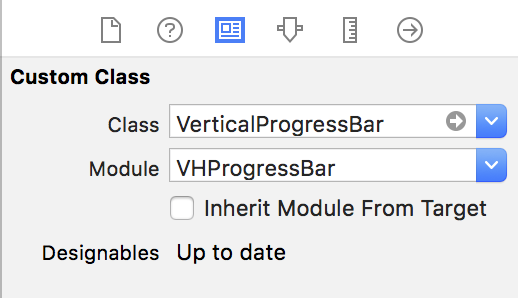
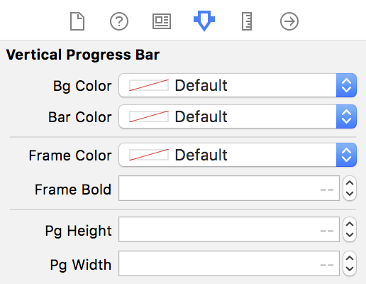

# VHProgressBar
The **VHProgressBar** is vertical and horizontal animated progress bar.




## Installation

### Cocoapods:

Add this code to your `Podfile`
```
pod 'VHProgressBar', '~> 1.0'
```
Install into your project:  
```
$ pod install
```

## Usage

### By coding with swift

``` swift
//import UIKit and VHProgressBar
import UIKit
import VHProgressBar

 // vertical progress bar
var verticalProgressBar: VerticalProgressBar!
// horizontal progress bar
var horizontalProgressBar: HorizontalProgressBar!


// start simple animation
verticalProgressBar.animateProgress(duration: 2.0, progressValue: 0.7)
horizontalProgressBar.animateProgress(duration: 3.0, progressValue: 0.2)

// start repeat animation
// you can choose type "normal" or "reverse"
verticalProgressBar.startAnimation(type: "normal", duration: 3.0)
//stop repeat animation  
verticalProgressBar.stopAnimation()

```


### By using storyboard

drop a UIView into your viewController in your storyboard, and set class to `VerticalProgressBar` or `HorizontalProgressBar`

  

customize your progressbar by setting the properties from the Interface Builder.

  

### Supported Attributes

|Attribute|Description|  
|:---|:---|  
|Bg Color|progress bar background color|
|Bar Color|progress bar color|
|Frame Color|the border color|
|Frame Bold|The border width|
|Pg Height|progress bar height|
|Pg Width|progress bar width|

## Contributions
Contributions are welcomed!!

## Version
1.0

## Author
Sohei Miyakura(miyass)
